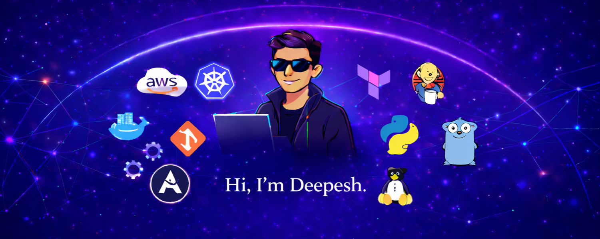

 

  <h2 align="center">
    <a href="https://deepesh-patil.vercel.app/">Portfolio</a> • 
    <a href="https://deepesh611.vercel.app/">GitHub Analytics</a>
  </h2>

I'm a passionate programmer specializing in **Cloud Computing ☁️, DevOps ♾️, and Network Engineering 🌐**. I thrive on building scalable systems, automating infrastructure, and tackling complex distributed computing challenges.

When I'm not coding, you'll likely find me:
- 🚗 **Driving** — Nothing beats the thrill of the open road.
- 🎮 **Gaming** — Virtual battles or real-life adventures, always up for a challenge.

Beyond tech, I enjoy leading teams and managing projects that bridge the gap between innovative ideas and real-world solutions.

---

---

## 📊 My Stats

  
  

  

---

<h2>
    Skills
</h2>

### 💬 Languages

### 🎨 Frontend

### 🗄️ Backend

### 💻 Operating Systems

### ⚙️ Tools

 

---

## 🛰️ Miscellaneous Tech

  
  
  

---

## 🏅 Achievements & Badges

  
    
  
   
  
  
  
  
    
  
    
  

---

## 📫 Let's Connect!

[][instagram]
[][linkedin]
[][twitter]

   

    
    
  

---

[instagram]: https://www.instagram.com/_deepesh_v.p/?next=%2F
[linkedin]: https://www.linkedin.com/in/deepesh-patil-103a87258/
[twitter]: https://twitter.com/DeepeshPat65731
