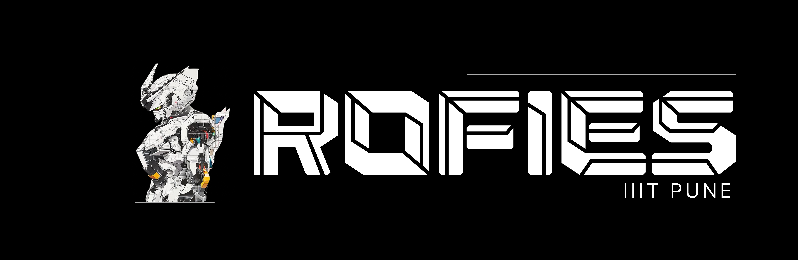
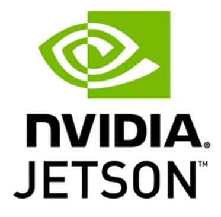
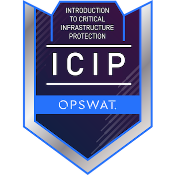
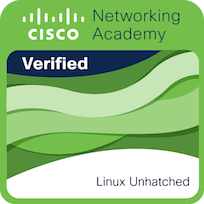

  <h3 align="center">
   👋 Hi there, I'm Deepesh.
  </h3>

  

    <a href="https://deepesh-patil.vercel.app/">Portfolio</a> •
    <a href="https://deepesh611.vercel.app/">Github Profile</a>
  

---

I’m a passionate programmer deeply into **Cloud Computing ☁️, DevOps ♾️, and Network Engineering 🌐**. I love exploring new tech, pushing boundaries, and solving challenging problems with creative strategies.

When I’m not coding, you'll likely find me:
- 🚗 **Driving** — Nothing beats the thrill of the open road.
- 🎮 **Gaming** — Virtual battles or real-life adventures, always up for a challenge.

Beyond tech, I enjoy **leading teams**, managing projects, and building strong connections. Whether through code, teamwork, or strategy — I always find a way to solve problems.

---

---

## 📊 My Stats

  
  
    
  

---

## 🧰 Languages & Tools

### 💬 Languages

### 🎨 Frontend

### 🗄️ Database

### 💻 Operating Systems

### ⚙️ Tools

 

---

## 🛰️ Miscellaneous Tech

  
  
  

---

## 🏅 Achievements & Badges

  
    
   
  
  
  
    
  
    
  

---

## 📫 Let's Connect!

[][instagram]
[][linkedin]
[][twitter]

   

 
  Visitor Count  
  

---

[instagram]: https://www.instagram.com/_deepesh_v.p/?next=%2F
[linkedin]: https://www.linkedin.com/in/deepesh-patil-103a87258/
[twitter]: https://twitter.com/DeepeshPat65731
